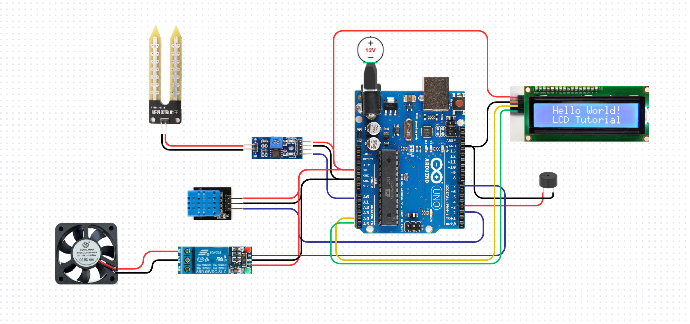
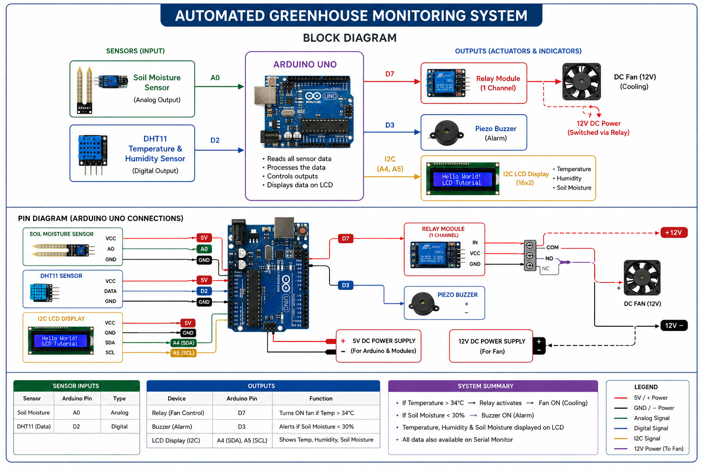
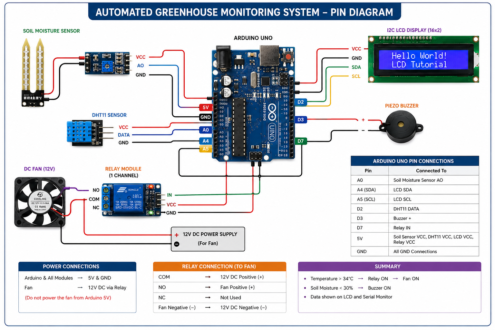

# Automated Greenhouse Monitoring System

An Arduino-based smart greenhouse monitoring and automation system designed to maintain optimal environmental conditions for plants. The system continuously tracks ambient temperature, humidity, and soil moisture levels, dynamically controlling a cooling fan and a water pump via relays, while providing real-time local display and alerts.

---

## Project Visuals

### Circuit Schematic

### Block Diagram

### Pin Diagram

---

## Key Features

* **Real-time Environmental Monitoring**: Continuous reading of temperature, relative humidity, and soil moisture levels.
* **Local LCD Display**: A 16x2 character LCD with an I2C backpack displays all metrics dynamically.
* **Automated Cooling**: Activates a cooling fan when temperature rises above 34°C to prevent overheating.
* **Automated Irrigation**: Triggers a water pump when soil moisture falls below 30% to maintain soil hydration.
* **Audio Alerts**: Sounds a piezo buzzer alarm when critical low soil moisture levels are detected.
* **Serial Debugging**: Outputs all data to the Serial Monitor at 9600 baud.

---

## Hardware Requirements

* **Microcontroller**: Arduino UNO
* **Sensors**:
  * DHT11 Temperature & Humidity Sensor
  * Soil Moisture Sensor (with driver board)
* **Actuators & Output**:
  * 16x2 LCD Display (I2C Module Address: `0x27`)
  * Piezo Buzzer (5V)
  * Single Channel Relay Module (5V trigger)
  * 5V DC Cooling/Exhaust Fan
* **Other**: Breadboard, jumper wires, external power adapter.

---

## Pin Connections

| Component | Pin on Component | Pin on Arduino UNO | Description |
| :--- | :--- | :--- | :--- |
| **DHT11 Sensor** | DATA | `D2` | Digital Input |
| **Buzzer** | `+` (Positive) | `D3` | Digital Output |
| **Relay 1 (Fan)** | IN | `D7` | Digital Output |
| **Soil Moisture** | AOUT | `A0` | Analog Input |
| **I2C LCD Display** | SDA | `A4` | I2C Data Line |
| **I2C LCD Display** | SCL | `A5` | I2C Clock Line |

*Note: All sensors and modules share the Arduino's `5V` (VCC) and `GND` lines.*

---

## Calibration & Thresholds

* **Temperature Threshold**: Set to `34°C` (Configured in `code.ino` via `#define TEMP_THRESHOLD 34`).
* **Soil Moisture Threshold**: Set to `30%` (Configured in `code.ino` via `#define SOIL_THRESHOLD 30`).
* **Soil Moisture Sensor Calibration**:
  * `SOIL_DRY (1023)`: The raw analog value when the sensor is completely dry (in air).
  * `SOIL_WET (300)`: The raw analog value when the sensor is fully submerged in water.

---

## Software Installation & Setup

1. **Prerequisites**: Install the [Arduino IDE](https://www.arduino.cc/en/software).
2. **Library Installation**: Open Arduino IDE, navigate to *Sketch* -> *Include Library* -> *Manage Libraries...*, and install:
   * **DHT sensor library** by Adafruit
   * **LiquidCrystal_I2C** by Frank de Brabander
   * **Adafruit Unified Sensor** (dependency for DHT)
3. **Upload Code**:
   * Open [`code.ino`](code.ino) in the Arduino IDE.
   * Connect your Arduino Uno to the computer.
   * Select the correct board and port in the Arduino IDE.
   * Click **Upload**.
